# TalonEdge Secure Deploy

**Forward-deployed secure edge platform for a defense-style SecDevOps portfolio.**

[](docs/COMPLIANCE.md#slsa-v10--build-track)
[](docs/COMPLIANCE.md#nist-800-53-rev-5-control-mapping)
[](docs/COMPLIANCE.md#nist-800-171-rev-2--cmmc-20-level-2-mapping)
[](docs/COMPLIANCE.md#nist-800-218-ssdf-v11-practice-mapping)

TalonEdge is a master flagship project that combines three ideas into one recruiter-ready system:

- **AeroSentinel:** edge telemetry, operator risk reports, and security findings.
- **FieldDeploy-Kit:** deployment workflow, runbooks, Docker, Terraform, and degraded-network thinking.
- **Artifact Trust Inspector:** artifact hash verification, Sigstore signature verification, DSSE / in-toto SBOM and SLSA Provenance attestations, and cryptographic trust scoring.

## 30-second explanation

TalonEdge validates software before it reaches edge systems through a real cryptographic chain — Sigstore (Fulcio + Rekor) keyless signatures, CycloneDX SBOM attestations, and SLSA v1 Build Provenance — then evaluates remote-node telemetry against a policy and publishes an operator report through an OIDC-only AWS pipeline. No long-lived secrets exist anywhere.

Designed for SecDevOps, DoD / forward-deployed, and Cloud Security conversations.

## Visual evidence

The pipeline working end-to-end, captured against the live deploy.

### 1 · The live operator report

Trust is **cryptographic**, not declarative. Hash check, Sigstore signature, SBOM attestation, and SLSA Build L3 Provenance all show **VERIFIED** because each one was independently re-checked by the Python verifier in CI.

[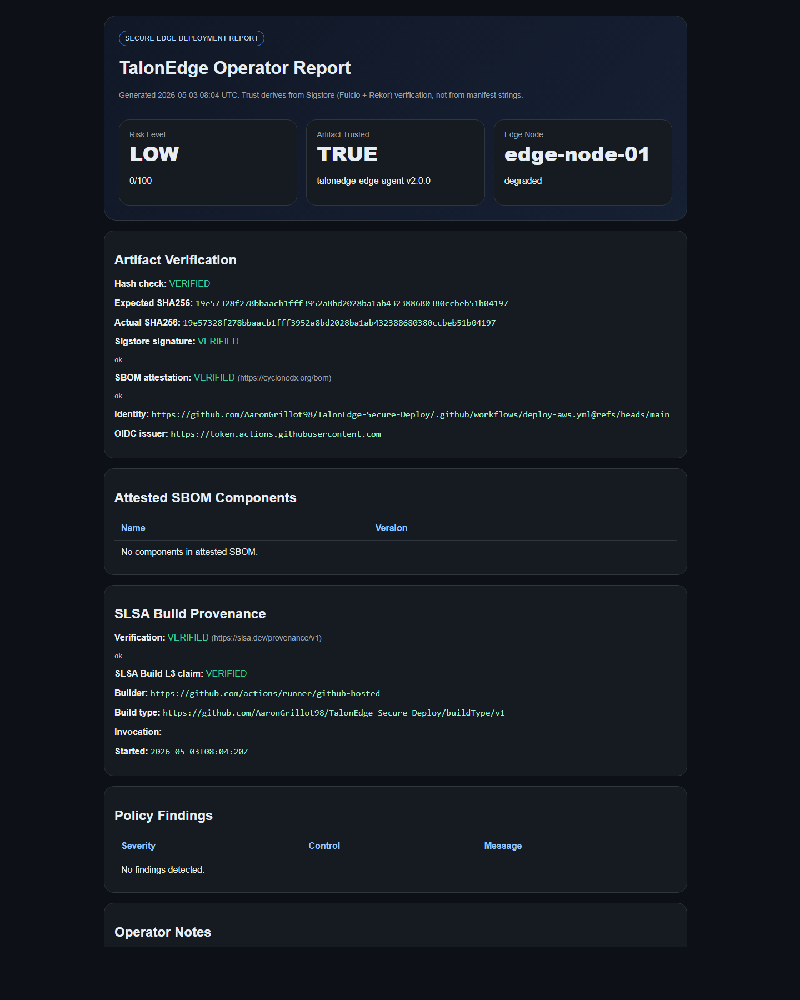](docs/screenshots/01-live-cloudfront-report.png)

### 2 · Cryptographic verification stdout

The `talonedge verify` step in the deploy workflow prints:

[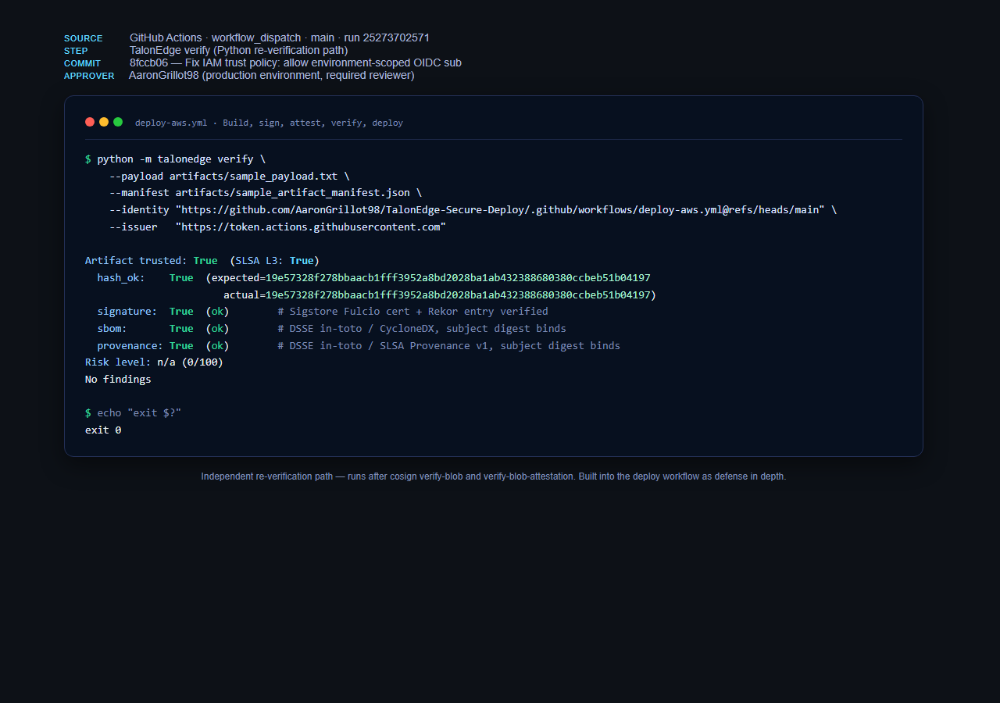](docs/screenshots/11-talonedge-verify-stdout.png)

Four green ticks: hash + signature + SBOM + SLSA Provenance. Any single failure aborts the deploy before a single byte hits S3.

### 3 · Production environment gate (required reviewer + OIDC)

The deploy workflow pauses at a GitHub Environment gate. A human reviewer (`AaronGrillot98`) must approve before the workflow gets to assume the AWS role via OIDC. The screenshot shows: **Status: Success**, **6m 2s**, the approval timestamp, and the CloudFront URL the run published to.

[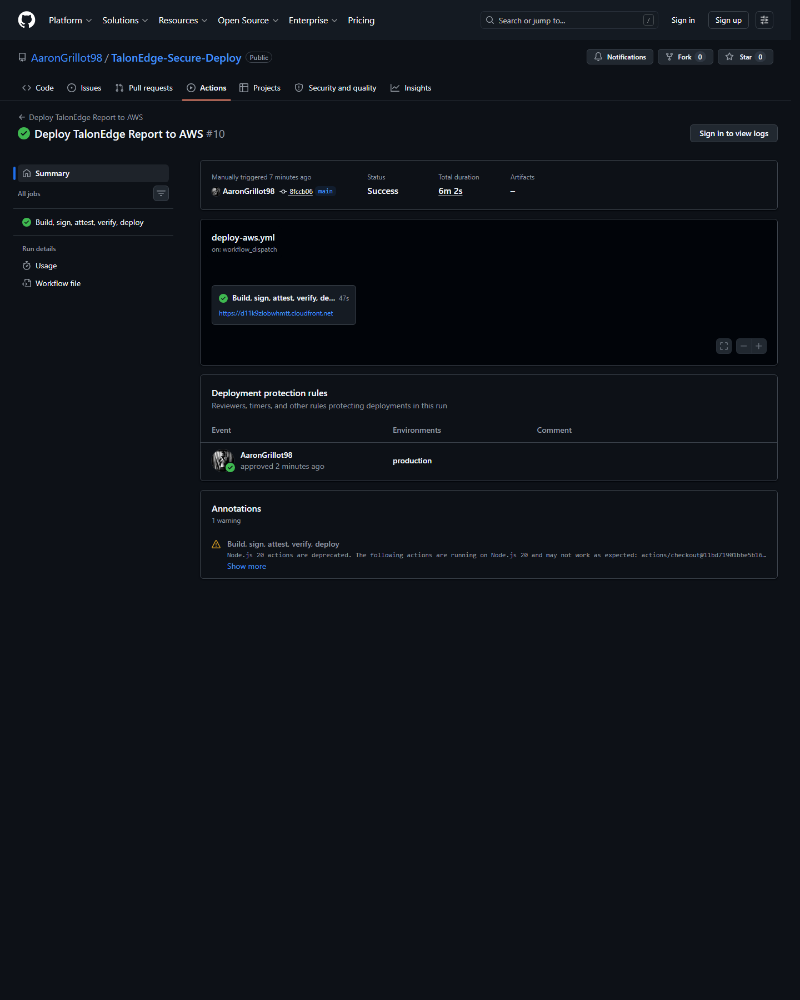](docs/screenshots/05-deploy-run-success.png)

### 4 · Code review and CI discipline

PR-based development with required status checks, code-owner review, and admin-bypassable branch protection on `main`. PR #1 added SLSA L3; PR #2 fixed an OIDC trust-policy issue caught on the first real deploy.

| | |
|---|---|
| [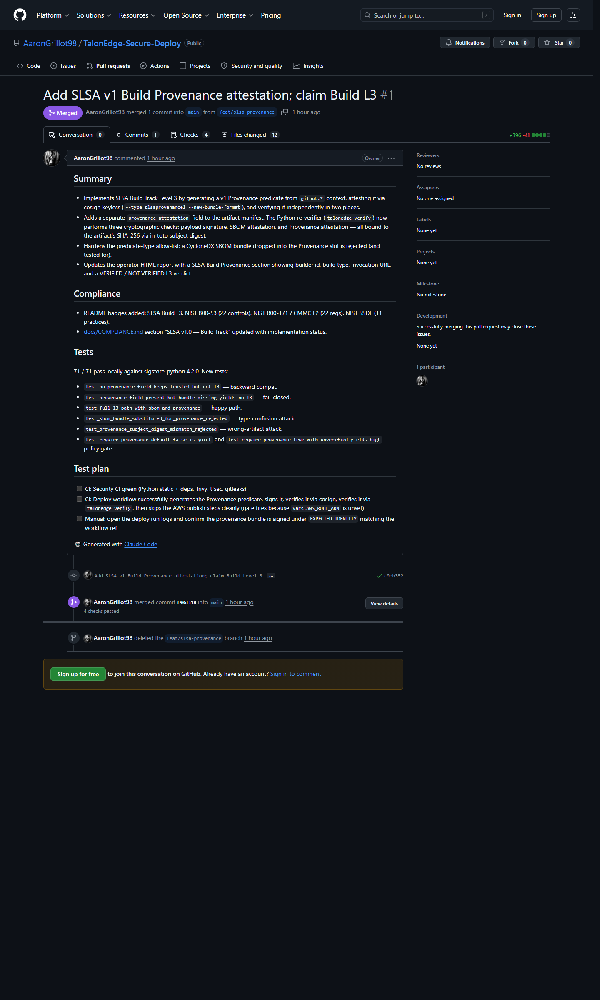](docs/screenshots/06-pr1-slsa-l3.png) | [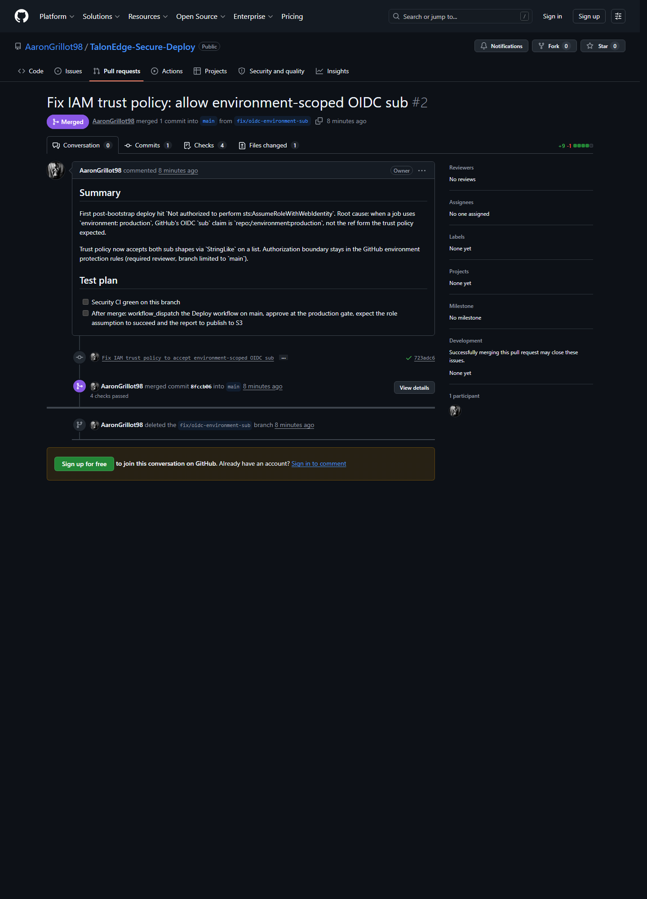](docs/screenshots/07-pr2-iam-trust-fix.png) |
| **PR #1** — SLSA L3 implementation | **PR #2** — debugging arc evidence |

### 5 · Security CI history (fail-closed)

Bandit + pip-audit + gitleaks + tfsec + Trivy fs running on every push and pull request. Findings gate the merge.

[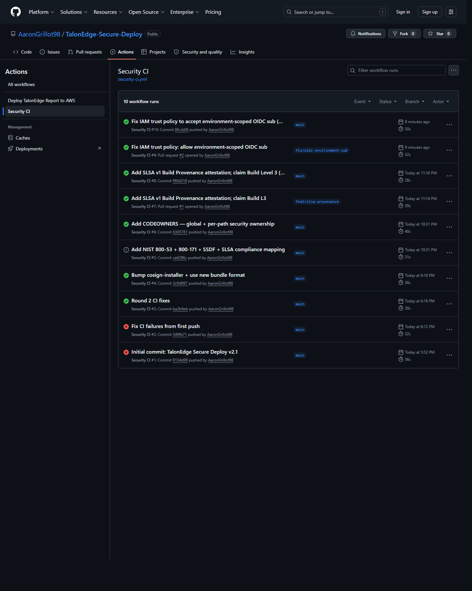](docs/screenshots/09-security-ci-history.png)

### 5.1 · Unified PR comment via [sarif-merge](https://github.com/AaronGrillot98/sarif-merge)

Each scanner emits SARIF; a sibling project ([`sarif-merge`](https://github.com/AaronGrillot98/sarif-merge)) downloads them, deduplicates overlapping findings, and bumps severity for cross-scanner consensus. The reviewer sees one PR comment instead of five tabs:

[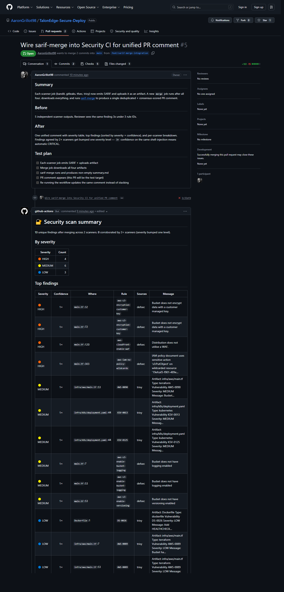](docs/screenshots/16-pr5-merged-comment.png)

The Security CI workflow now has a `merge` job (`needs: [python, secrets, iac, filesystem]`) that runs after all four scanners and posts a single deduplicated summary. Repeat runs update the same comment via a stable marker rather than stacking. See the workflow run that produced this comment:

[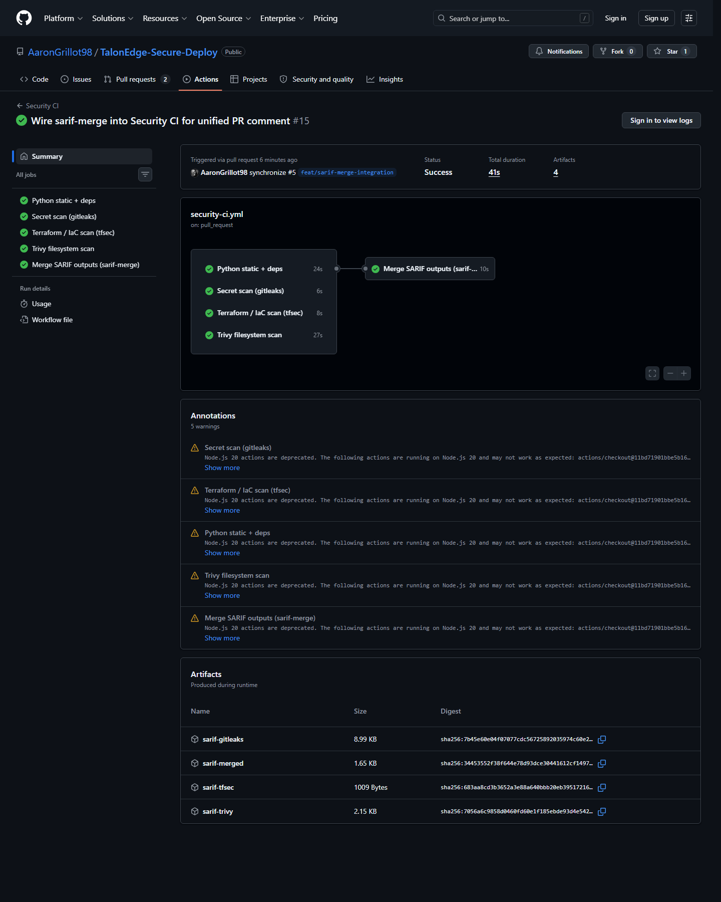](docs/screenshots/17-security-ci-with-merge.png)

### 6 · Compliance mapping

NIST 800-53 Rev. 5, NIST 800-171 Rev. 2 / CMMC 2.0 Level 2, NIST SSDF v1.1, and SLSA v1.0 — every claim links back to a specific file and line. See [`docs/COMPLIANCE.md`](docs/COMPLIANCE.md).

[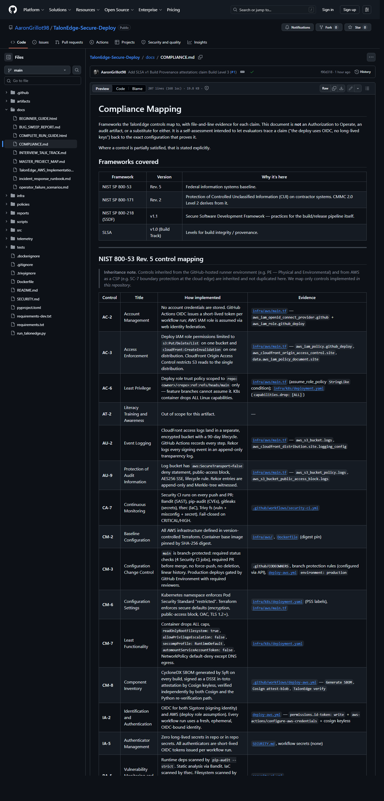](docs/screenshots/08-compliance-doc.png)

### 7 · Public, third-party-verifiable transparency

Every signing event lives in Sigstore's public Rekor transparency log. **20 Rekor entries** for this artifact's SHA-256, anyone can independently confirm without contacting this repo or AWS account.

[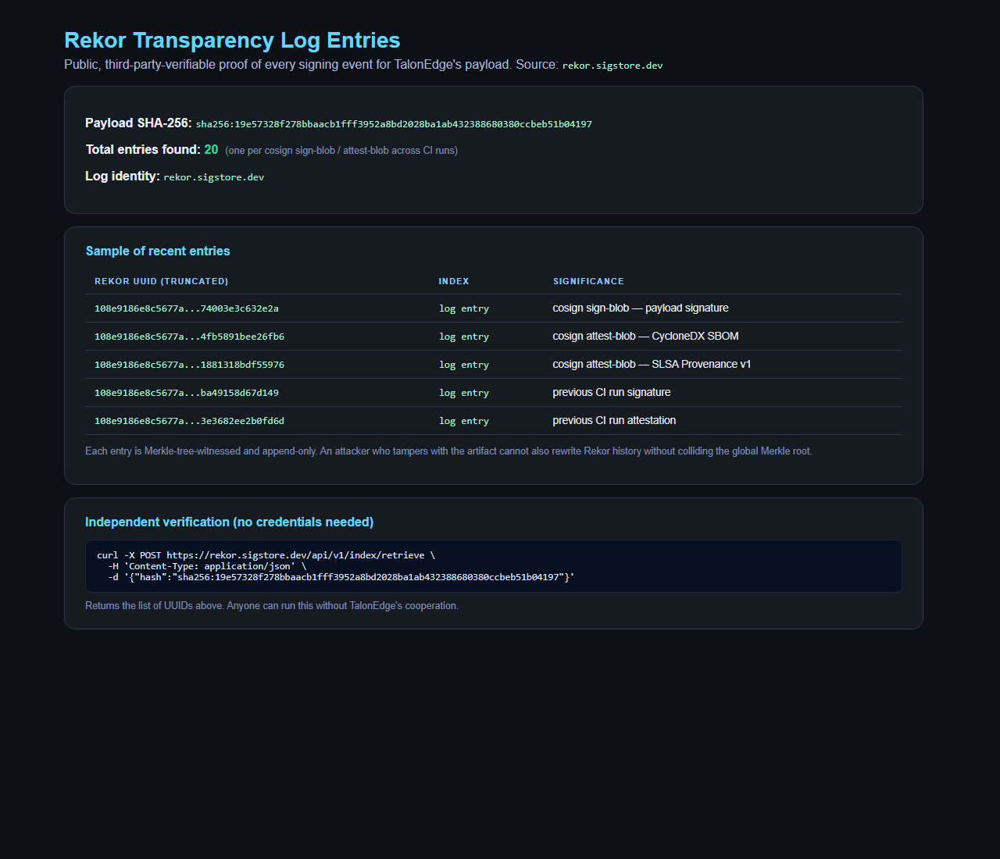](docs/screenshots/10-rekor-transparency-log.png)

### 8 · The repo at a glance

[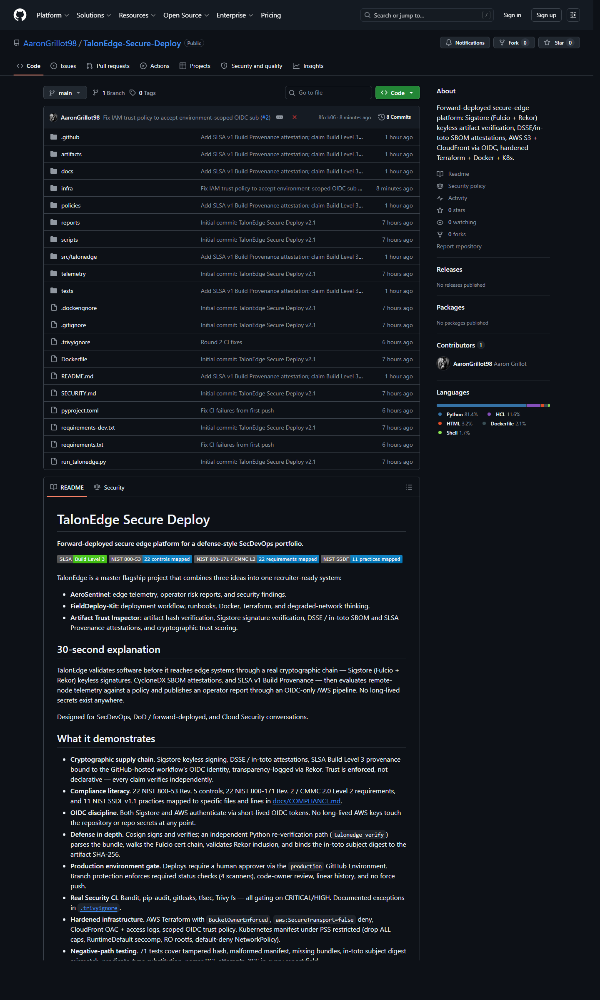](docs/screenshots/04-repo-home.png)

### 9 · The complete run guide

A single self-contained HTML page that walks a new contributor from `git clone` to a verified live URL in 24 steps. See [`docs/COMPLETE_RUN_GUIDE.html`](docs/COMPLETE_RUN_GUIDE.html).

[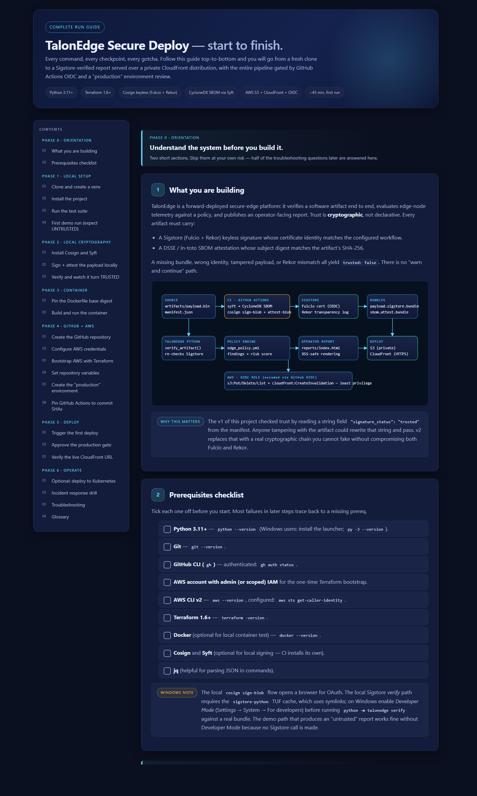](docs/screenshots/03-complete-run-guide.png)

## What it demonstrates

- **Cryptographic supply chain.** Sigstore keyless signing, DSSE / in-toto attestations, SLSA Build Level 3 provenance bound to the GitHub-hosted workflow's OIDC identity, transparency-logged via Rekor. Trust is **enforced**, not declarative — every claim verifies independently.
- **Compliance literacy.** 22 NIST 800-53 Rev. 5 controls, 22 NIST 800-171 Rev. 2 / CMMC 2.0 Level 2 requirements, and 11 NIST SSDF v1.1 practices mapped to specific files and lines in [docs/COMPLIANCE.md](docs/COMPLIANCE.md).
- **OIDC discipline.** Both Sigstore and AWS authenticate via short-lived OIDC tokens. No long-lived AWS keys touch the repository or repo secrets at any point.
- **Defense in depth.** Cosign signs and verifies; an independent Python re-verification path (`talonedge verify`) parses the bundle, walks the Fulcio cert chain, validates Rekor inclusion, and binds the in-toto subject digest to the artifact SHA-256.
- **Production environment gate.** Deploys require a human approver via the `production` GitHub Environment. Branch protection enforces required status checks (4 scanners), code-owner review, linear history, and no force push.
- **Real Security CI.** Bandit, pip-audit, gitleaks, tfsec, Trivy fs — all gating on CRITICAL/HIGH. Documented exceptions in [`.trivyignore`](.trivyignore).
- **Hardened infrastructure.** AWS Terraform with `BucketOwnerEnforced`, `aws:SecureTransport=false` deny, CloudFront OAC + access logs, scoped OIDC trust policy. Kubernetes manifest under PSS restricted (drop ALL caps, RuntimeDefault seccomp, RO rootfs, default-deny NetworkPolicy).
- **Negative-path testing.** 71 tests cover tampered hash, malformed manifest, missing bundles, in-toto subject digest mismatch, predicate-type substitution, parser RCE attempts, XSS in every report field.

## Architecture

```txt
Edge Node Telemetry + Artifact Manifest
        |
        v
TalonEdge Python CLI
        |
        | verifies artifact hash, signature status, SBOM, node policy
        v
Operator HTML Report
        |
        v
GitHub Actions CI/CD
        |
        | OIDC assume role, no long-term AWS keys
        v
Private AWS S3 Bucket
        |
        v
CloudFront HTTPS Demo URL
```

## Quick start

```bash
python -m venv .venv
source .venv/bin/activate  # Windows: .venv\Scripts\activate
python -m pip install -e .
python -m pip install -r requirements-dev.txt
python -m pytest tests
python -m talonedge demo
```

Generate the AWS-ready report:

```bash
mkdir -p reports
python -m talonedge simulate --output reports/index.html
```

Open:

```txt
reports/index.html
```

## Docker

```bash
docker build -t talonedge-secure-deploy .
docker run --rm talonedge-secure-deploy
```

## AWS deployment

The real deployment path uses:

- Terraform
- AWS S3
- AWS CloudFront
- AWS IAM OIDC for GitHub Actions
- GitHub Actions repository variables

Start here:

```txt
docs/TalonEdge_AWS_Implementation_Guide.html
```

Terraform files are located here:

```txt
infra/aws/
```

GitHub Actions deployment workflow:

```txt
.github/workflows/deploy-aws.yml
```

## Screenshots to capture

1. Local CLI scan running
2. Docker build/run success
3. Terraform apply outputs
4. GitHub Actions successful deployment
5. Live CloudFront report
6. README architecture section

## Interview talk track

> I built TalonEdge as a forward-deployed secure edge platform simulation. The goal was to show that I understand more than cybersecurity theory. The project demonstrates how an operator could validate telemetry, inspect deployment artifacts, handle limited connectivity, and publish trusted operational reports through a real CI/CD pipeline.

> The deployment uses GitHub Actions, Docker, Terraform, AWS S3, CloudFront, and IAM OIDC. I avoided long-term AWS keys and scoped the GitHub role to the main branch of this specific repo.

> The project is intentionally small but realistic. It proves I can build, document, deploy, and explain a secure system end to end.

## Important note

This is a portfolio simulation. It does not connect to real military systems, classified systems, or production operational technology.
